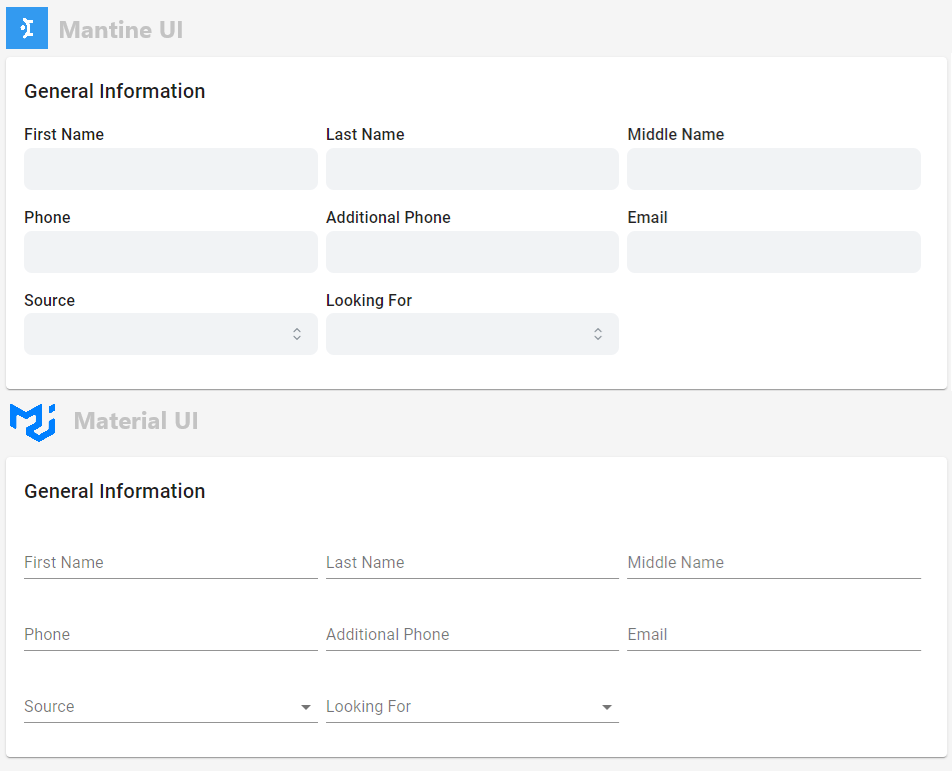

# ⚛️ react-declarative-mantine

> The [mantine ui kit](https://mantine.dev/) bindings for [react-declarative](https://github.com/react-declarative/react-declarative)



## Installation

> Link to [the playground](https://react-declarative-mantine.github.io/)

```tsx
import "@mantine/core/styles.css";
import "@mantine/dates/styles.css";

import { MantineProvider } from "@mantine/core";
import { OneSlotFactory } from "react-declarative-mantine";

const wrappedApp = (
    <MantineProvider>
        <OneSlotFactory>
            <App />
        </OneSlotFactory>
    </MantineProvider>
);

```
